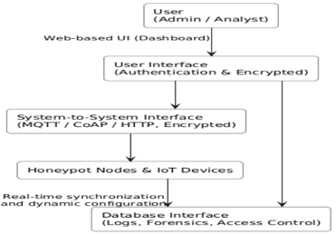

# CamDecept – Adaptive IoT Honeypot Framework

## Overview

CamDecept is a graduation project developed by a team of Cybersecurity students at King Saud University.

The project proposes an adaptive IoT honeypot framework that leverages cyber deception techniques to detect, monitor, and analyze cyberattacks targeting IoT surveillance devices. This repository documents the project, its architecture, design, and research outcomes through the graduation reports and supporting diagrams.

---

## System Architecture

---

## Overview

The framework aims to improve IoT security by deploying decoy services that attract attackers, record malicious activities, and provide valuable threat intelligence for security analysis.

Key objectives include:

- Detecting cyberattacks targeting IoT devices.
- Monitoring attacker behavior.
- Collecting attack logs for analysis.
- Supporting cybersecurity research and education.

---

## Dashboard

---

## Use Case Diagram

---

## System Interface

---

## CamDecept Architecture

---

## Features

- Adaptive IoT Honeypot
- Cyber Deception Techniques
- Behavioral Analysis
- Real-Time Attack Monitoring
- Threat Detection
- Attack Logging
- Dashboard Visualization
- Risk Scoring

---

## Technologies

- Python
- Flask
- .NET 8
- MySQL / Firebase
- React / Flutter
- JSONL Logging
- HTTP
- RTSP
- SSH
- MQTT
- IoT Security
- Cyber Deception

---

## Attack Scenarios

The framework is designed to detect activities such as:

- Brute Force Attacks
- Port Scanning
- Unauthorized Access
- Reconnaissance
- Suspicious Login Attempts
- MQTT Unauthorized Access
- REST API Abuse

---

## Repository Contents

- Graduation Project Report 1
- Graduation Project Report 2
- System Architecture
- Dashboard Design
- Research Documentation

---

## Project Documentation

- 📄 [Graduation Project Report 1](docs/IoT%20Honeypot%20%26%20Deception%20Framework.pdf)
- 📄 [Graduation Project Report 2](docs/CamDecept%20An%20Adaptive%20Honeypot.pdf)

---

## Team Members

This graduation project was completed by:

- Jana Aldawas
- Dunia Alshahrani
- Layan Alshmmasi
- Maysoon Alkhaldi
- Sara Salman
- Ohoud Alshehri
- Buthaina Alhajlah

---

## Academic Notice

This repository is intended for academic, educational, and portfolio purposes only.

The reports and documentation are shared to demonstrate the project design, research process, and system architecture developed as part of the Cybersecurity Graduation Project at King Saud University.
